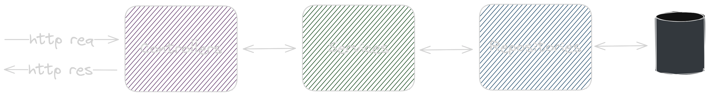

# Software Projects Management System using Microservices

**Objective:** The main goal of this project is to learn the basics of microservices architecture communication and put in practice some design and architecture patterns. 

**Disclaimer:** The technologies used are not intended to be optimal nor for a production environment, I tried to keep it simple in order to accomplish the main objective of the project.

## Index

-  [Description](#description)

-  [Architecture](#architecture)

-  [Dependencies](#dependencies)

-  [Instalation](#instalation)

-  [Configuration](#configuration)

-  [Testing](#testing)

-  [Author](#author)

## Description

This project is designed for a software factory company that offers customizable base software products to meet the specific needs of their clients. When a client engages the company, a suitable software product is selected for the project. A 'project leader' can claim an unassigned project, after which a team is automatically chosen using an algorithm. 

Once the project is underway, requirements can be uploaded, and team members can update their state and log tasks associated with each requirement. When all requirements are completed, the project can be marked as finished. Only a 'team leader' or the member responsible of the requirement can update the its state. The responsible member is designed by the 'team leader'. A record of the period of time in which someone was responsible of a requirement must be stored.

Any team member can upload tasks developed for a specific requirement through the project life cycle, but only certain types of tasks depending on the requirement state. Each requirement state defines what types of tasks can be uploaded.

The company that use this application is able to define what states a requirement can go through.

### Microservices Description

Every microservice sends an async message for each CRUD operation performed to the others microservices subscribed to that topic.

- **Auth:** Authenticates users returning a JWT, and Authorizes requests. Each microservice, when is consumed, sends a sync message to this microservice to check if the JWT provided is valid.
- **Members:** Members and Roles CRUD operations. 
- **Products:** Products CRUD operations.
- **Projects:** Clients CRUD operations, Projects register and state changes. 
- **Teams:** Teams CRUD operations, including defining the team members and its role. Also is responsible of assigning a team to a project.
- **Tasks:** Not defined yet
- **Requirements:** Not defined yet

**Limitations:**

For this version: 

- Do not include any payment module.
- It is not needed to implement how the transitions between the 'requirements states' would work.

## Architecture

### Architecture Diagram

### Entities Class Diagram

### Architecture Description

Springboot was the choice for every microservice because it's the programming language that I'm more familiar with, not for any particular requirement. If I had chosen any other language, it would've taken much more time and I wouldn't be able to focus on learning microservices. Besides, at this moment I'd like to get a job as a Java developer so it's the right choice to reinforce my knowledge-

Since I wanted to try the most vanilla microservice development experience, I decided not to use Spring Cloud despite its compatibility with Spring microservices. I believe this approach allows me to learn later other technologies, like Spring Cloud or Kubernetes and not be attached to a specific one.

For the same reason, I decided not to include a Gateway API. There're a lot of Cloud Gateway API, and it's not relevant for what I'm most interested about: the async/sync communication between microservices. How the application would be consumed in a production environment, it's out of the scope of this project.

The DBMS chosen is MySQL, again, because it's the one that I'm most familiar with. 

The message broker is Kafka because I wanted to learn it over RabbitMQ, not for any technical reason. I just see more Java developer job offers that requires Kafka. 

### Spring microservices architecture

I believe the most suitable architecture for each microservice is the 3-layer architecture: Controllers receive http requests and delegate the business logic to the Services. The Repository layer is in charge of accessing the database for R/W operations. After executing the corresponding method, the Controller returns an http response.

## Dependencies

The only requirement needed to execute the application is [Docker](https://www.docker.com/), each container has its own dependencies so there's no need to install Java, Gradle, Apache Kafka, etc.

## Instalation

You can clone the repository from Github using the UI or the command line using:

`git clone https://github.com/marcosespeche/software_projects`

Then, execute the docker-compose.yml file:

`docker-compose build`
`docker-compose up`

All the dependencies will start downloading within the containers. When it finishes, the application will be running.

## Configuration

**Ports used by default**

If any of these ports are used by other service on your local machine, the application won't start. You must kill any process listening on the following ports:

- Zookeper: 2181
- Apache Kafka: 9092
- MySQL: 3306
- Projects microservice: 8080
- Teams microservice: 8081
- Members microservice: 8082
- Auth microservice: 8083
- Products microservice: 8084

Alternatively, you can change the ports on the docker-compose.yml file

## Testing

Automated tests were developed using JUnit4, also manual testing can be performed using the Postman file in the repository

## Author

- **Marcos Espeche** - [LinkedIn](http://www.linkedin.com/in/marcos-espeche-villalón-962821208)