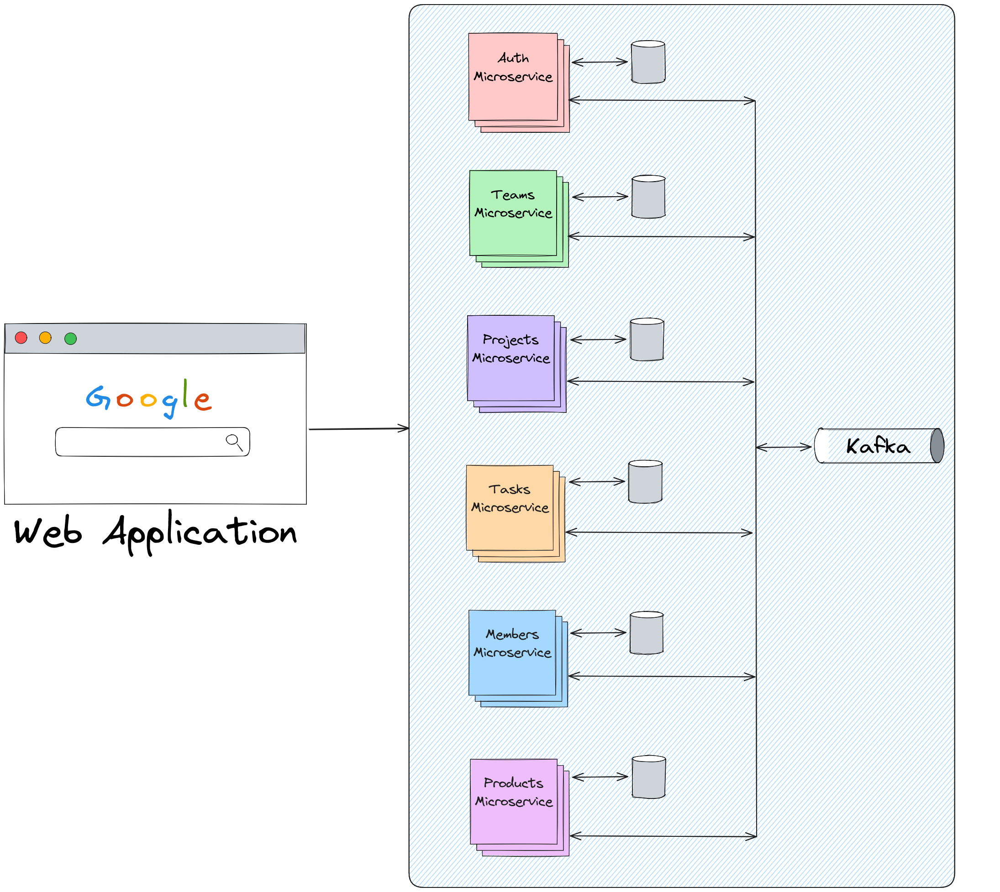
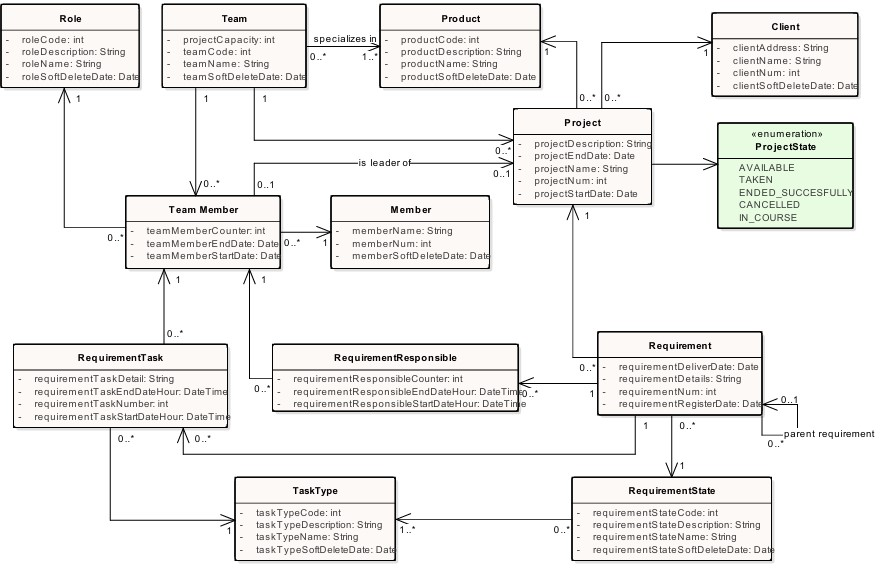

# Software Projects Management System using Microservices

**Objective**

The main objective of this project is to learn the basics of microservices architecture. 

**Disclaimer**

The technologies used are not intended to be optimal nor for a production environment, I tried to keep it simple in order to accomplish the main objective of the project.

**Brief business description** 

This project is designed for a software factory company that offers customizable base software products to meet the specific needs of their clients. When a client engages the company, a suitable software product is selected for the project. A 'project leader' can claim an unassigned project, after which a team is automatically chosen using an algorithm. Once the project is underway, requirements can be uploaded, and team members can update their status and log tasks associated with each requirement. When all requirements are completed, the project can be marked as finished.

## Index

-  [Description](#description)

-  [Architecture](#architecture)

-  [Requirements](#requirements)

-  [Instalation](#instalation)

-  [Usage](#usage)

-  [Configuration](#configuration)

-  [Testing](#testing)

-  [Author](#author)

## Description

**Limitations:**

Does not include any payment module.

## Architecture

### Architecture Diagram

### Entities Class Diagram

### Architecture Description

Springboot was the choice for every microservice because it's the programming language that I'm more familiar with, not for any particular requirement. If I had chosen any other language, it would've taken much more time and I wouldn't be able to focus on learning microservices.

Since I wanted to try the most vanilla microservice development experience, I decided not to use Spring Cloud despite its compatibility with Spring microservices. I believe this approach allows me to learn later other technologies, like Spring Cloud or Kubernetes and not be attached to a specific one.

## Requirements

The only requirement needed to execute the API is Docker, each container has its own dependencies so there's no need to install Java, Gradle, Apache Kafka, etc.

## Instalation

## Usage

## Configuration

## Testing

## Author

- **Marcos Espeche** - [LinkedIn](www.linkedin.com/in/marcos-espeche-villalón-962821208)